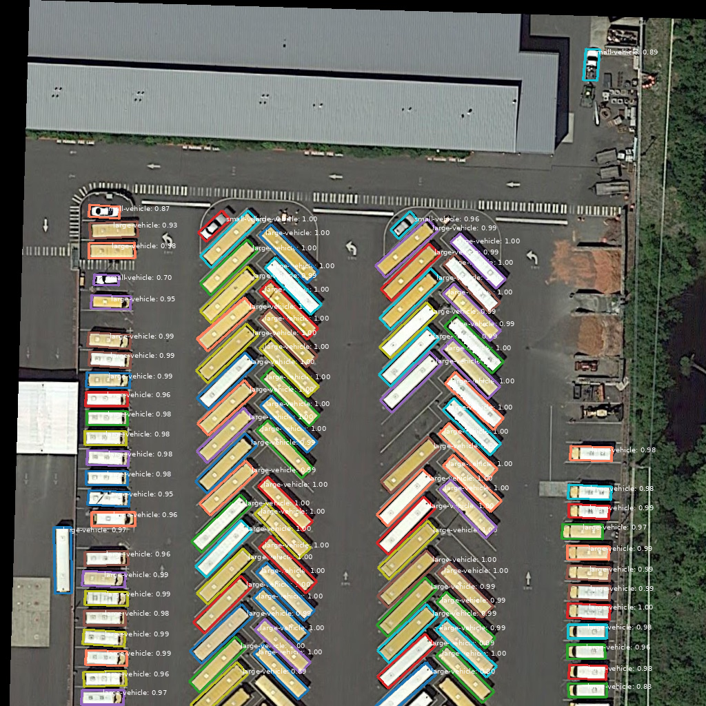

# OrientedDet

**OrientedDet** is a lightweight, modern PyTorch library for **rotated object detection** in aerial and satellite imagery. It focuses on clean geometry, reliable operators, simple datasets, and practical baseline models—without the complexity of large detection frameworks. OrientedDet is designed for researchers, practitioners, and geospatial developers who need accurate rotation-aware detectors with a minimal API.

<p align="center">
  
</p>

<p align="center"><em>Oriented R-CNN on the bundled <code>demo/demo.jpg</code> tile — rotated boxes follow vehicle heading instead of swallowing neighbours in axis-aligned rectangles.</em></p>

**Docs:** [dl4eo.github.io/oriented-det](https://dl4eo.github.io/oriented-det/) · **Blog:** [deeplearning.earth](https://deeplearning.earth) · **Company:** [dl4eo.com](https://dl4eo.com) (consulting and custom development)

## Features

- **Geometry**: Rotated bounding boxes (rbox: cx, cy, w, h, angle), quadrilateral boxes (qbox), polygon ↔ rbox ↔ hbox conversions, angle normalization (le90, 0–180°), flip/rotate/scale transforms, visualization helpers
- **IoU & NMS**: Rotated IoU and oriented NMS (CPU with optional GPU kernels when available); AABB pre-filtering; `obb_to_xyxy` / HBB conversion
- **Datasets**: DOTA polygon loader (pattern, split file, or separate folders), **HRSC2016** native XML loader, **FAIR1M** 37-class XML loader (+ convert/tile tutorial), **SSDD** and **HRSID** SAR ship loaders (finetune DOTA 1× Hub locally; no SAR zoo), image tiling, label filtering, ignore masks, oriented mAP evaluation
- **Models**: **Oriented R-CNN** ([Xie et al., ICCV 2021](https://openaccess.thecvf.com/content/ICCV2021/html/Xie_Oriented_R-CNN_for_Object_Detection_ICCV_2021_paper.html); horizontal RPN + MidpointOffset → oriented RoIAlign + oriented ROI head), **Rotated Faster R-CNN** (Ren et al., NeurIPS 2015 two-stage baseline with horizontal RPN + horizontal RoIAlign + rotated ROI head; MMRotate reference), **Rotated RetinaNet** ([Lin et al., ICCV 2017](https://openaccess.thecvf.com/content_ICCV_2017/papers/Lin_Focal_Loss_for_ICCV_2017_paper.pdf); oriented anchors, sigmoid focal loss), **Rotated FCOS** (anchor-free single-stage; distance-angle coder, centerness, L1 / KFIoU / decoded rIoU); ResNet + FPN backbones; selective loading of external checkpoints where configs wire `checkpoint.load_from_checkpoint`
- **Training**: JSON configs + **`odet train`**, mixed precision (AMP), gradient accumulation, checkpointing, best-metric tracking, TensorBoard, optional curriculum learning and profiling
- **ONNX export**: pre-NMS ONNX + Python NMS (`python -m export` / `make export-onnx`); consumers run ONNX Runtime only

Hands-on write-ups (code, metrics, inference knobs) live on **[DeepLearning.Earth](https://deeplearning.earth)** — especially the [15 DOTA class tour](https://deeplearning.earth/posts/2026-06-23_oriented_rcnn_detections_for_the_15_dota_classes/), [sampled rIoU and ProbIoU](https://deeplearning.earth/posts/2026-07-10_rotated_faster_rcnn_probiou_dota/), [Rotated FCOS / v0.2.0](https://deeplearning.earth/posts/2026-08-28_oriented-det_v0_2_0_rotated_fcos_decoded_riou_and_the_updated_zoo/), and [macOS FCOS vs Oriented R-CNN](https://deeplearning.earth/posts/2026-09-02_rotated_fcos_vs_oriented_rcnn_on_macos/).

## Installation

- **Python** >= 3.10. Use [uv](https://docs.astral.sh/uv/) to install Python versions and manage the virtual environment.
- From the repo root (Linux with CUDA 12.1):

```bash
# Make sure you're in the project directory
cd ~/oriented-det

# Install uv if needed: https://docs.astral.sh/uv/getting-started/installation/
# Create a venv with Python 3.12 (uv downloads the interpreter if missing)
uv venv --python 3.12
source .venv/bin/activate

# Install PyTorch with CUDA 12.1 from PyTorch's index (2.4.0 or a higher version is fine)
uv pip install "torch>=2.4.0" "torchvision>=0.19.0" --index-url https://download.pytorch.org/whl/cu121

# Install dependencies and the project in editable mode
uv pip install -r requirements.txt
uv pip install -e .
```

- To auto-activate `.venv` when entering this repo, install the [`direnv`](https://direnv.net/) shell hook and run `direnv allow` from the repo root. The local `.envrc` is intentionally gitignored so each developer can opt in on their machine.
- From PyPI: `pip install oriented-det`
- For development and tests: `uv pip install -e ".[dev]"`
- For the Gradio prediction viewer: `uv pip install -e ".[viewer]"` or `pip install "oriented-det[viewer]"`
- For **ONNX export**: `uv pip install -e ".[export]"` then `python -m export --help` (see [ONNX export](docs/examples/export.md))
- For **macOS Apple Silicon** or **CPU-only**, see [Installation](docs/getting-started/installation.md) and the [macOS walkthrough](https://deeplearning.earth/posts/2026-06-25_oriented_object_detection_on_macos_in_pure_python/) (`odet image-demo` on MPS, no CUDA toolchain).
- Verify: `pytest tests/test_geometry.py tests/test_iou.py tests/test_nms.py`

## Quick start

After [installation](#installation):

```bash
# Train on DOTA tiles (edit dataset paths in the config first)
odet train --config configs/oriented_rcnn/dota_le90_1x.json

# Or use the Makefile wrapper (same default config)
make train
```

Default starter recipe: `configs/oriented_rcnn/dota_le90_1x.json` (see [configs/oriented_rcnn/README.md](configs/oriented_rcnn/README.md)). Use `configs/oriented_rcnn/dota_le90_3x.json` when you want the longer Oriented R-CNN schedule.

Programmatic APIs and a longer walkthrough: [Getting Started](docs/getting-started/installation.md). Config fields: [Configuration](docs/user-guide/configuration.md).

### Paths in documentation and configs

Examples throughout this repo use placeholder paths such as **`/path/to/data`** and **`/path/to/oriented-det`**. You can point commands and JSON configs at your real locations (e.g. `dataset.data_root` in a training config), or keep those placeholders and map them with symbolic links:

```bash
# Create the parent directory (may need sudo for paths under /path/to)
sudo mkdir -p /path/to

# Point the placeholder at your DOTA dataset
ln -s /home/username/dota /path/to/data

# Point the placeholder at your clone of this repo
ln -s /home/username/oriented-det /path/to/oriented-det
```

After that, copy-pasted commands and unmodified configs that reference `/path/to/data` or `/path/to/oriented-det` resolve to your machine. Use relative symlink targets when you want the link to stay valid if the parent directory moves.

## Repository layout

| What | Where | You use it for |
|------|--------|----------------|
| **Library** | [`oriented_det/`](oriented_det/) | Geometry, models, datasets, training engine, ops — import in Python or extend in your own code |
| **CLI** | **`odet`** ([`oriented_det/cli/`](oriented_det/cli/)) | Train, tile data, run val inference, metrics, demos — **primary interface** after `uv pip install -e .` |
| **CLI implementations** | [`tools/`](tools/) | Python modules that implement `odet` subcommands (train, preds, tiling, …). Not a separate “old” API; contributors and debugging may call `python -m tools.train` directly |
| **Configs** | [`configs/`](configs/) | Experiment JSON (`_base_` inheritance, schema in `configs/config.schema.json`) |
| **Runs** | `runs/<model_type>/<timestamp>/` | Checkpoints, `config.json` snapshot, `train.log` (created at train time; not shipped in the repo) |
| **Docs** | [`docs/`](docs/) | MkDocs user guide and API reference |
| **Examples** | [`demo/`](demo/), [`pretrained/`](pretrained/), [`notebooks/`](notebooks/), [`export/`](export/) | Demo images; Hub checkpoints; Kaggle FAIR1M tutorial notebook; ONNX export producer (`python -m export`) |

**`odet` vs `tools/`:** Installing the package registers the `odet` command. It loads modules under `tools/` (for example `tools.train`, `tools.save_predictions`). Shared inference and collate code lives in [`oriented_det/runtime/`](oriented_det/runtime/). You do not need two workflows — use **`odet`** (or **`make`**, which calls `odet`).

**Publishing a clean tree:** Ship the library, configs, docs, and tests. Omit local experiment output (`runs/`), datasets, and machine-specific paths in configs/Makefile.

## Documentation

Full documentation is in the **docs/** folder and can be built and served with MkDocs:

- **Build/serve**: `make docs` or `make docs-serve` (see [docs/README.md](docs/README.md)); or `uv pip install -e ".[docs]"` then `mkdocs serve`.
- **Guides**: [Getting Started](docs/getting-started/installation.md), [User Guide](docs/user-guide/geometry.md), [API Reference](docs/api/geometry.md), [Examples](docs/examples/inference.md), [ONNX export](docs/examples/export.md).
- **Blog**: [DeepLearning.Earth](https://deeplearning.earth) — curated posts below (code, metrics, inference knobs).

| Topic | Post |
|-------|------|
| Why OrientedDet / Apache 2.0 stack | [https://deeplearning.earth/posts/2026-06-22_oriented-det_v0_1_0_sovereign_oriented_object_detection_for_eo/](https://deeplearning.earth/posts/2026-06-22_oriented-det_v0_1_0_sovereign_oriented_object_detection_for_eo/) |
| Visual detections (15 DOTA classes) | [https://deeplearning.earth/posts/2026-06-23_oriented_rcnn_detections_for_the_15_dota_classes/](https://deeplearning.earth/posts/2026-06-23_oriented_rcnn_detections_for_the_15_dota_classes/) |
| `odet image-demo` on Apple Silicon | [https://deeplearning.earth/posts/2026-06-25_oriented_object_detection_on_macos_in_pure_python/](https://deeplearning.earth/posts/2026-06-25_oriented_object_detection_on_macos_in_pure_python/) |
| Sliding-window inference (`demo/large.jpg`) | [https://deeplearning.earth/posts/2026-06-29_announcing_the_final_oriented_det_pretrained_model/](https://deeplearning.earth/posts/2026-06-29_announcing_the_final_oriented_det_pretrained_model/) |
| Sentinel-2 ships (`--zoom`, class filter) | [https://deeplearning.earth/posts/2026-06-25_zero-shot_ship_detection_on_a_copernicus_sentinel-2_tile_with_oriented_rcnn/](https://deeplearning.earth/posts/2026-06-25_zero-shot_ship_detection_on_a_copernicus_sentinel-2_tile_with_oriented_rcnn/) |
| Sampled rIoU, ProbIoU, Faster R-CNN Task 1 | [https://deeplearning.earth/posts/2026-07-10_rotated_faster_rcnn_probiou_dota/](https://deeplearning.earth/posts/2026-07-10_rotated_faster_rcnn_probiou_dota/) |
| Zoo / MMRotate parity | [https://deeplearning.earth/posts/2026-07-11_oriented-det_v0_1_1_prob_iou_mmrotate_parity_and_the_updated_zoo/](https://deeplearning.earth/posts/2026-07-11_oriented-det_v0_1_1_prob_iou_mmrotate_parity_and_the_updated_zoo/) |
| Rotated FCOS, decoded rIoU, four-family zoo | [https://deeplearning.earth/posts/2026-08-28_oriented-det_v0_2_0_rotated_fcos_decoded_riou_and_the_updated_zoo/](https://deeplearning.earth/posts/2026-08-28_oriented-det_v0_2_0_rotated_fcos_decoded_riou_and_the_updated_zoo/) |
| FCOS vs Oriented R-CNN (MPS latency, thresholds) | [https://deeplearning.earth/posts/2026-09-02_rotated_fcos_vs_oriented_rcnn_on_macos/](https://deeplearning.earth/posts/2026-09-02_rotated_fcos_vs_oriented_rcnn_on_macos/) |
| Side-by-side browser demo (three 1× checkpoints) | [https://deeplearning.earth/posts/2026-09-06_oriented_det_optical_satellite_demo/](https://deeplearning.earth/posts/2026-09-06_oriented_det_optical_satellite_demo/) |
| Apache 2.0 vs DOTA / HRSC dataset terms | [https://deeplearning.earth/posts/2026-09-10_oriented_det_apache_license_versus_dota/](https://deeplearning.earth/posts/2026-09-10_oriented_det_apache_license_versus_dota/) |

## Documentation by folder

| Folder | README | Description |
|--------|--------|-------------|
| [demo/](demo/) | [demo/README.md](demo/README.md) | Demo images; `odet image-demo` or `make demo` with the latest `runs/` checkpoint. Write-ups: [macOS image-demo](https://deeplearning.earth/posts/2026-06-25_oriented_object_detection_on_macos_in_pure_python/) · [sliding-window (`demo/large.jpg`)](https://deeplearning.earth/posts/2026-06-29_announcing_the_final_oriented_det_pretrained_model/) |
| [pretrained/](pretrained/) | [pretrained/README.md](pretrained/README.md) | Registered checkpoints for fine-tunes; large `.pth` files are usually gitignored |
| [oriented_det/cli/](oriented_det/cli/) | [oriented_det/cli/README.md](oriented_det/cli/README.md) | **`odet`** entry point and subcommand list |
| [tools/](tools/) | [tools/README.md](tools/README.md) | CLI script implementations (invoked by `odet`; see [Repository layout](#repository-layout)) |
| [configs/](configs/) | [configs/README.md](configs/README.md) | DOTA configs and **pretrain model zoo** (`_base_` inheritance) |
| [deploy/example/](deploy/example/) | [deploy/example/README.md](deploy/example/README.md) | Minimal DOTA deploy smoke image |
| [export/](export/) | [export/README.md](export/README.md) | ONNX export producer (`python -m export`); consumer bundle in gitignored `onnx_export/` |
| [docs/](docs/) | [docs/README.md](docs/README.md) | MkDocs source; full user guide and API reference |

## Training and evaluation

Install once: `uv pip install -e .`. Then:

| Task | Command |
|------|---------|
| Train | `odet train --config configs/oriented_rcnn/dota_le90_1x.json` or `make train` |
| Multi-GPU | `make train-multi-gpu` (`torchrun` + cuDNN on `LD_LIBRARY_PATH`) |
| Tile DOTA | `odet tile-dota /path/to/data/DOTA-v1.0/train` |
| HRSC2016 → DOTA (optional) | `odet hrsc-to-dota --data-root /path/to/data/HRSC2016 --output-dir /path/to/data/HRSC2016-dota` |
| SSDD → DOTA (optional) | `odet ssdd-to-dota --data-root /path/to/data/Official-SSDD-OPEN --output-dir /path/to/data/SSDD-dota` |
| COCO polygons → DOTA | `odet coco-to-dota --ann-file instances.json --image-dir images --output-dir out` |
| Val predictions | `odet preds --experiment-dir runs/oriented_rcnn/<timestamp>` or `make preds` |
| Offline mAP | `make eval-val` or `make preds` then `make metrics`. DOTA: leaky val tiles (real test is Task 1). HRSC/FAIR1M/SSDD/HRSID: held-out test/val. |
| ONNX export | `make export-onnx` or `python -m export onnx ...` (see [export/README.md](export/README.md)) |

DOTA configs: per-model `dota_le90_1x.json` under [configs/](configs/) (3× where published; Faster R-CNN and FCOS DOTA are 1×). Run `odet --help` for all subcommands. Makefile shortcuts and script-level options: [tools/README.md](tools/README.md). Config reference: [docs/user-guide/configuration.md](docs/user-guide/configuration.md), [configs/config.schema.json](configs/config.schema.json), [configs/README.md](configs/README.md).

## Pretrained weights and evaluation

- Place exported best checkpoints under **`pretrained/`** or use Hub slugs (`odet pretrained download oriented_rcnn_dota_le90_3x`, `rotated_faster_rcnn_dota_le90_1x`, `rotated_faster_rcnn_dota_le90_3x`, `rotated_fcos_dota_le90_1x`, or `oriented_rcnn_hrsc2016_le90_3x` / `rotated_faster_rcnn_hrsc2016_le90_3x` / `rotated_fcos_hrsc2016_le90_3x`). See [pretrained/README.md](pretrained/README.md) and [configs/README.md](configs/README.md#dota-pretrained-models-model-zoo). Zoo write-ups: [v0.1.1](https://deeplearning.earth/posts/2026-07-11_oriented-det_v0_1_1_prob_iou_mmrotate_parity_and_the_updated_zoo/) · [v0.2.0 FCOS](https://deeplearning.earth/posts/2026-08-28_oriented-det_v0_2_0_rotated_fcos_decoded_riou_and_the_updated_zoo/) · [optical satellite demo](https://deeplearning.earth/posts/2026-09-06_oriented_det_optical_satellite_demo/).
- **Tiled validation:** after training, run `make preds` then `make metrics`. Published mAP reports: [`docs/eval-reports/`](docs/eval-reports/) (git). Raw detections for the viewer: gitignored [`predictions/`](predictions/).

## Important notes

- **Angles**: Radians; use a single convention (e.g. le90 for DOTA). Helper: `normalize_le90` from `oriented_det.geometry`. For angle-delta normalization in custom code, see `oriented_det.models.oriented_rpn.normalize_angle_delta`.
- **NMS**: `torchvision.ops.nms_rotated` does not exist; the project uses a Python-based oriented NMS with AABB pre-filtering. GPU kernels are used when available.
- **ROI/memory**: Training samples 512 proposals per image; use `roi_chunk_size` and `roi_use_checkpoint` for memory tuning on large GPUs.

## Roadmap

See **[docs/roadmap.md](docs/roadmap.md)** for the full public plan. Summary:

- **v0.1** (shipped): Geometry, IoU/NMS, DOTA, three ResNet-FPN detectors, config training, Hub pretrained weights
- **v0.1.1** (shipped): ProbIoU Faster R-CNN 1×/3× on Hub
- **v0.2** (shipped): Rotated FCOS (anchor-free single-stage); Hub `rotated_fcos_dota_le90_1x` (73.07% official Task 1)
- **v0.3** (shipped): HRSC2016 loader + Hub 3× zoo (Oriented R-CNN 90.41%, Faster R-CNN 88.77%, FCOS 88.34% eval-val); FAIR1M loader + 1× recipes; SSDD + HRSID SAR loaders + 1× recipes (SSDD Faster R-CNN held-out **90.34%**, HRSID **78.55%**; train locally, no SAR Hub)
- **v0.4**: RTMDet-R and native YOLO-OBB (AGPL-free production tier)
- **v0.5+**: Swin-FPN backbone; optional fused CUDA kernels; hosted docs

## Contributing

Contributions are welcome. Run tests with `pytest`, format with `black` and `ruff`. See [docs/contributing.md](docs/contributing.md) for guidelines.

## Consulting and custom development

OrientedDet is Apache-2.0 open source. For **consulting, training workshops, or custom development** (dataset design, on-prem training, production packaging), see **[DL4EO](https://dl4eo.com)**.

## Publishing to PyPI

Version **0.3.0** — tag releases as **`v0.3.0`** (git) matching `version` in `pyproject.toml`.

Configs: edit **`configs/`** at the repo root, then **`make sync-configs`** so **`oriented_det/configs/`** stays in sync (see **`oriented_det/configs/vendored_manifest.txt`**). CI runs **`make check-configs`**.

Install publishing tools (included in `.[dev]`):

```bash
uv pip install -e ".[dev]"   # or: make publish-deps
```

### Step-by-step: first release (v0.1.0)

#### 1. One-time PyPI setup

1. Create accounts on [test.pypi.org](https://test.pypi.org) and [pypi.org](https://pypi.org) (can use the same email).
2. **Register the project name** `oriented-det` on PyPI (first upload creates it; TestPyPI is separate).
3. **Trusted Publishing (recommended)** — on each index, add a publisher for `DL4EO/oriented-det`, workflow `publish.yml`, environments `testpypi` / `pypi`. See [.github/workflows/README.md](.github/workflows/README.md).
4. **Or API tokens** — create `pypi-…` tokens and export locally (or add GitHub secrets `TESTPYPI_API_TOKEN`, `PYPI_API_TOKEN`):

```bash
export TWINE_USERNAME=__token__
export TWINE_PASSWORD=pypi-AgEI…   # TestPyPI or PyPI token
```

#### 2. Pre-release checklist

```bash
make check-configs
pytest tests/ -q
```

Bump version in `pyproject.toml` and `docs/changelog.md` if needed (currently **0.3.0**).

#### 3. Build locally

```bash
make sync-configs   # after changing configs/ or the manifest
make build          # check-configs + sdist + wheel into dist/
make twine-check
```

Smoke-test the wheel:

```bash
python -m venv /tmp/odet-smoke && source /tmp/odet-smoke/bin/activate
pip install torch torchvision --index-url https://download.pytorch.org/whl/cpu
pip install dist/*.whl
odet --help
python -c "from oriented_det.geometry import RBox; print(RBox(0,0,1,1,0).area)"
```

#### 4. Upload to TestPyPI

```bash
make publish-testpypi
```

Install from TestPyPI (PyPI index still needed for dependencies like `torch`):

```bash
pip install --index-url https://test.pypi.org/simple/ --extra-index-url https://pypi.org/simple oriented-det==0.1.0
odet --help
```

Or trigger **Actions → Publish → Run workflow** (target: `testpypi`) after configuring Trusted Publishing or secrets.

#### 5. Tag and upload to production PyPI

When TestPyPI looks good:

```bash
git tag -a v0.1.0 -m "Release 0.1.0"
git push origin v0.1.0          # triggers publish.yml → PyPI (if CI is configured)
```

Local upload (fallback):

```bash
make publish-pypi
```

Create a [GitHub Release](https://github.com/DL4EO/oriented-det/releases) from tag `v0.1.0` with notes from `docs/changelog.md`.

#### 6. After publish

- Verify `pip install oriented-det` in a clean environment.
- Users still install **PyTorch** separately for their CUDA/CPU platform.

### Makefile targets

| Target | Action |
|--------|--------|
| `make publish-deps` | Install `build` and `twine` |
| `make build` | `check-configs` + `python -m build` |
| `make twine-check` | Validate `dist/*` metadata |
| `make publish-testpypi` | Build, check, upload to TestPyPI |
| `make publish-pypi` | Build, check, upload to PyPI |

Notes:

- **Trusted Publishing** avoids long-lived tokens; keep `make publish-*` for manual releases. Details: [.github/workflows/README.md](.github/workflows/README.md).

## License

**Apache-2.0** — Copyright © Jeff Faudi and [DL4EO](https://dl4eo.com). See [LICENSE](LICENSE) for details.

The framework license does not grant rights to the **DOTA** or **HRSC** datasets. See [Apache 2.0 vs DOTA / HRSC dataset terms](https://deeplearning.earth/posts/2026-09-10_oriented_det_apache_license_versus_dota/).

## Acknowledgements

Design and APIs are informed by MMRotate, MMDetection, Detectron2, and related work in oriented object detection; **pretrained checkpoints in `pretrained/` are OrientedDet exports from this codebase**, not MMRotate zoo bundles.
