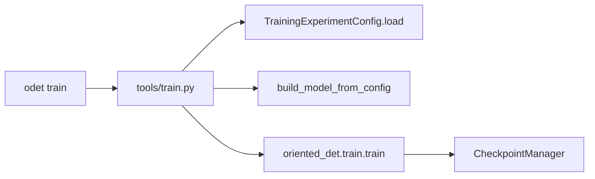

# Code and documentation analysis report

**Date:** 2026-06-15  
**Scope:** Full repo — MkDocs user guide, folder READMEs, config recipes, core library, CLI/tools, and training run `runs/rotated_retinanet/20260612-121232`.

---

## 1. Surface inventory matrix

| Surface | Code counterpart | Status | Notes |
|---------|------------------|--------|-------|
| [`docs/index.md`](index.md) | Root [`README.md`](../README.md) | OK | Install, Hub, DL4EO links aligned |
| [`docs/getting-started/installation.md`](getting-started/installation.md) | `pyproject.toml`, `requirements.txt` | OK | uv + CUDA paths match root README |
| [`docs/getting-started/quickstart.md`](getting-started/quickstart.md) | `odet train`, `configs/` | OK | |
| [`docs/getting-started/tools.md`](getting-started/tools.md) | [`oriented_det/cli/__init__.py`](../oriented_det/cli/__init__.py), [`tools/`](../tools/) | Partial | Many `odet` subcommands undocumented here (see §3) |
| [`docs/user-guide/configuration.md`](user-guide/configuration.md) | [`oriented_det/train/config.py`](../oriented_det/train/config.py), [`configs/config.schema.json`](../configs/config.schema.json) | OK | Schema fields match dataclasses; RetinaNet `rpn_*`/`roi_*` reuse only in config READMEs |
| [`docs/user-guide/training.md`](user-guide/training.md) | [`tools/train.py`](../tools/train.py), [`oriented_det/train/engine.py`](../oriented_det/train/engine.py) | OK | Engine, schedulers, checkpointing documented |
| [`docs/user-guide/models.md`](user-guide/models.md) | [`oriented_det/models/`](../oriented_det/models/) | Partial | Missing training vs eval/export path split for two-stage models |
| [`docs/user-guide/data.md`](user-guide/data.md) | [`oriented_det/data/`](../oriented_det/data/), [`runtime/collate.py`](../oriented_det/runtime/collate.py) | Partial | MkDocs warns on relative links to `configs/` and `tools/README.md` |
| [`docs/user-guide/operations.md`](user-guide/operations.md) | [`oriented_det/ops/`](../oriented_det/ops/) | OK | Backend policy in ops README |
| [`docs/user-guide/geometry.md`](user-guide/geometry.md) | [`oriented_det/geometry/`](../oriented_det/geometry/) | OK | |
| [`docs/user-guide/utils.md`](user-guide/utils.md) | [`oriented_det/utils/`](../oriented_det/utils/) | OK | Points to configuration guide |
| [`docs/examples/training.md`](examples/training.md) | `odet train`, configs | OK | |
| [`docs/examples/inference.md`](examples/inference.md) | [`tools/save_predictions.py`](../tools/save_predictions.py) | Partial | Analysis artifact names not listed (see §3) |
| [`docs/api/*.md`](api/) | Package `__init__.py` modules | OK | Six mkdocstrings pages; griffe warnings on a few annotations |
| [`configs/README.md`](../configs/README.md) | `configs/`, schema | OK | |
| [`configs/rotated_retinanet/README.md`](../configs/rotated_retinanet/README.md) | `rotated_retinanet.py`, recipes | OK | Richest architecture doc; matches 3× run behavior |
| [`configs/rotated_faster_rcnn/README.md`](../configs/rotated_faster_rcnn/README.md) | `rotated_faster_rcnn.py`, recipes | OK | |
| [`configs/oriented_rcnn/README.md`](../configs/oriented_rcnn/README.md) | `oriented_rcnn.py`, recipes | OK | |
| [`oriented_det/models/README.md`](../oriented_det/models/README.md) | Model forward paths | OK | Training vs `faster_rcnn_inference` split documented here only |
| [`oriented_det/train/README.md`](../oriented_det/train/README.md) | `engine.py`, `config.py` | OK | |
| [`oriented_det/cli/README.md`](../oriented_det/cli/README.md) | CLI dispatch table | OK | Fuller command list than getting-started tools page |
| [`tools/README.md`](../tools/README.md) | All `tools/*.py` | OK | Analysis artifacts documented in detail |
| [`oriented_det/pretrained/manifest.json`](../oriented_det/pretrained/manifest.json) | `runs/`, Hub assets | Partial | `eval_map50` ≠ training final mAP (see §5) |
| 31 folder READMEs | Local packages | OK | Per prior audit |

---

## 2. Automated validation results

| Check | Result | Detail |
|-------|--------|--------|
| `make docs` | **Pass** | Built in ~7s; 4 link warnings in `user-guide/data.md`, `user-guide/models.md` |
| `pytest` (config/hub subset) | **47 passed** | `test_training_config_strict`, `test_utils_config`, `test_pretrained_hub` |
| `pytest tests/` (editable install) | **383 passed**, 2 skipped | CI uses `pip install -e ".[dev]"` |
| Config dataclasses vs `config.schema.json` | **Aligned** | All sections match field-for-field (dataset 23, model 53, training 38, etc.) |
| Hub manifest vs `runs/` | **4/4 runs exist** | All `source_recipe` JSON files present |
| Vendored configs | Not re-run | CI runs `make check-configs` on push |

**MkDocs warnings (non-fatal):**

- `user-guide/data.md` — relative links to `../configs/*.json` and `../../tools/README.md` (MkDocs expects GitHub URLs per [`documentation.md`](documentation.md))
- `user-guide/models.md` — relative link to `../../pretrained/README.md`
- Griffe — missing type hints on a few parameters in `transforms.py`, model constructors, `iou.py`

---

## 3. CLI surface vs documentation

**Registered in `oriented_det/cli/__init__.py`:**

`train`, `train-multi-gpu`, `preds`, `metrics`, `lr-finder`, `stats`, `tile-dota`, `image-demo`, `viewer`, `playground-csv`, `playground-to-dota`, `labels-to-comma`, `free-gpu`, `pretrained`.

| Command | `cli/README.md` | `getting-started/tools.md` | `tools/README.md` |
|---------|-----------------|---------------------------|-------------------|
| train | Yes | Yes | Yes |
| train-multi-gpu | Yes | No | Yes (via Makefile) |
| preds / metrics | Yes | Yes | Yes |
| image-demo, viewer | Yes | Partial | Yes |
| tile-dota, stats, lr-finder | Yes | No | Yes |
| playground-* | Yes | No | Yes |
| pretrained | No | No | Yes |
| labels-to-comma, free-gpu | No | No | Yes |

---

## 4. Critical path documentation coverage

### 4.1 Training loop



**Coverage:** Documented | Sources: [`docs/user-guide/training.md`](user-guide/training.md), [`tools/train.py`](../tools/train.py), [`oriented_det/train/README.md`](../oriented_det/train/README.md).

### 4.2 Rotated RetinaNet

**Coverage:** Documented | Sources: [`configs/rotated_retinanet/README.md`](../configs/rotated_retinanet/README.md), [`oriented_det/models/rotated_retinanet.py`](../oriented_det/models/rotated_retinanet.py).

Verified behaviors vs 3× run:

- 5-level FPN (P3–P7), octave anchors, HBB matching (`use_hbb_for_matching: true`)
- Focal cls via `loss.loss_type: focal` + `model.roi_focal_*` wiring in `train.py`
- Val mAP at `evaluation.train_val_score_threshold: 0.3`, `max_detections_per_image: 300`
- Deploy decode in frozen `production.*`: `inference_pre_nms_score_threshold: 0.05`, `max_detections_per_image: 2000`, `final_nms_use_cpu: true`
- Periodic mAP uses GPU sampling; final mAP uses exact CPU IoU

**Gap:** User guide [`configuration.md`](user-guide/configuration.md) model-key table does not explain that RetinaNet reuses `model.rpn_*` for anchor assign thresholds and `model.roi_*` for focal head settings (documented only in config README).

### 4.3 Two-stage inference / export split

**Coverage:** Partially documented | Package README only.

- Training: eager `horizontal_roi_align` in model `forward` — [`oriented_det/models/README.md`](../oriented_det/models/README.md) lines 9–15
- Eval/export: `faster_rcnn_inference.faster_rcnn_inference()` — same file
- [`docs/user-guide/models.md`](user-guide/models.md) does **not** mention this split

### 4.4 Inference and metrics (`odet preds`)

**Coverage:** Partially documented |

- [`tools/README.md`](../tools/README.md) documents `analysis_iou*.json`, `model_analysis_*.md`, per-class AP tables, confusion matrix
- [`docs/examples/inference.md`](examples/inference.md) only says "optional analysis plots" — artifact filenames and `--per-class-threshold-analysis` not mentioned

---

## 5. Training run cross-reference

**Run:** `runs/rotated_retinanet/20260612-121232`  
**Recipe:** `configs/rotated_retinanet/dota_le90_3x.json`  
**Hub slug:** `rotated_retinanet_dota_le90_3x`

### Recipe vs frozen `config.json`

| Field | Recipe | Run | Match |
|-------|--------|-----|-------|
| `training.num_epochs` | 36 | 36 | Yes |
| `lr_scheduler_milestones` | [24, 33] | [24, 33] | Yes |
| `evaluation.train_val_score_threshold` | 0.3 | 0.3 | Yes |
| `evaluation.compute_map_final` | true | true | Yes |
| `evaluation.compute_map_every_n_epochs` | 4 | 4 | Yes |
| `evaluation.use_exact_rotated_iou` | false | false | Yes |
| `evaluation.use_exact_rotated_iou_for_final_map` | true | true | Yes |
| `model.max_detections_per_image` | 300 | 300 | Yes |
| `source_recipe` | — | `configs/rotated_retinanet/dota_le90_3x.json` | Yes |

Resolved config inherits 1× base (`dota_le90_1x.json`) for dataset, model anchors, `production` deploy defaults, and preprocessing.

### mAP curve (GPU-sampled periodic / exact final)

| Epoch | mAP | Backend |
|-------|-----|---------|
| 4 | 39.52% | GPU sampling |
| 8 | 58.36% | GPU sampling |
| 12 | 57.08% | GPU sampling |
| 16 | 64.11% | GPU sampling |
| 20 | 68.41% | GPU sampling |
| 24 | **71.13%** | GPU sampling (Hub `eval_map50`) |
| 28 | 75.86% | GPU sampling |
| 32 | 75.39% | GPU sampling |
| 36 | 75.52% | GPU sampling |
| Final (best ckpt) | **75.94%** | Exact CPU polygon |

Peak periodic mAP at epoch 24 (71.13%) matches Hub manifest `eval_map50: 0.7152` (from `odet preds` pipeline, not final training mAP).

### Hub manifest note

Manifest `eval_map50` reflects **published preds/metrics evaluation**, not `compute_map_final` from training. Document this distinction in [`pretrained/README.md`](../pretrained/README.md) and Hub tables in config READMEs.

---

## 6. Findings (severity-ranked)

### High impact

| ID | Severity | Finding | Location |
|----|----------|---------|----------|
| F1 | Missing | Hub `eval_map50` vs training `final mAP` not explained; readers may compare 71.5% Hub number to 75.9% training log | `manifest.json`, config READMEs, `pretrained/README.md` |
| F2 | Missing | Two-stage **training vs eval/export** code path not in published user guide | `docs/user-guide/models.md` vs `oriented_det/models/README.md` |

### Medium impact

| ID | Severity | Finding | Location |
|----|----------|---------|----------|
| F3 | Partial | `docs/getting-started/tools.md` omits half of `odet` commands (`train-multi-gpu`, `tile-dota`, `stats`, `lr-finder`, `pretrained`, etc.) | `docs/getting-started/tools.md` |
| F4 | Partial | Inference example does not name analysis artifacts (`analysis_iou0.50.json`, `model_analysis_*.md`) or key flags | `docs/examples/inference.md` vs `tools/README.md` |
| F5 | Stale | MkDocs build warns on relative out-of-tree links | `docs/user-guide/data.md`, `docs/user-guide/models.md` |
| F6 | Partial | RetinaNet config key reuse (`rpn_*` / `roi_*` for anchors/focal) absent from user guide | `docs/user-guide/configuration.md` |

### Low impact

| ID | Severity | Finding | Location |
|----|----------|---------|----------|
| F7 | Redundant | CLI command list duplicated inconsistently across `cli/README`, `tools/README`, `getting-started/tools` | Multiple |
| F8 | OK | Config schema ↔ Python dataclasses fully aligned | `config.py`, `config.schema.json` |
| F10 | OK | 3× RetinaNet run matches recipe and config README expectations | Run `20260612-121232` |

---

## 7. Recommended actions

| Priority | Action | Type |
|----------|--------|------|
| 1 | Add subsection to `pretrained/README.md` and config Hub tables: `eval_map50` is from `odet preds` on val tiles, not `compute_map_final` | Doc |
| 2 | Add "Training vs inference paths" subsection to `docs/user-guide/models.md` (link to `oriented_det/models/README.md`) | Doc |
| 3 | Expand `docs/getting-started/tools.md` command table (mirror `oriented_det/cli/README.md`) | Doc |
| 4 | Update `docs/examples/inference.md` with analysis artifact names and `--per-class-threshold-analysis` | Doc |
| 5 | Fix MkDocs link warnings: use GitHub URLs for `configs/*.json`, `tools/README.md`, `pretrained/README.md` in user guide | Doc |
| 6 | Add RetinaNet footnote to model-key table in `configuration.md` for `rpn_*`/`roi_*` reuse | Doc |
| 7 | (Optional) Add `docs/api/runtime.md` for `oriented_det.runtime` — not in current API nav | Doc |

---

## 8. Validation commands used

```bash
make docs
pytest tests/test_training_config_strict.py tests/test_utils_config.py tests/test_pretrained_hub.py
pip install -e ".[dev]" && pytest tests/ -q
```
